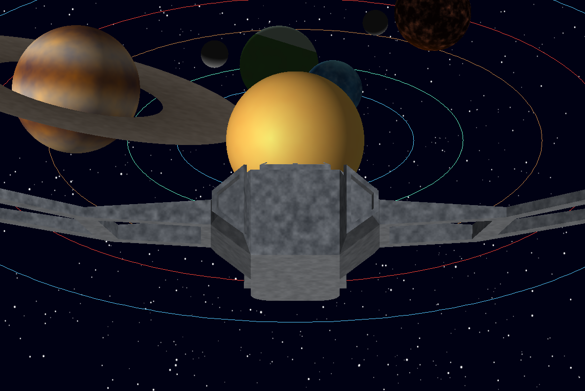

# Proyecto Sistema Solar con Shaders

Software renderer escrito en Rust que genera un pequeño sistema solar únicamente con fragment shaders. Cada cuerpo celeste se construye con ruido procedural y múltiples capas de detalle para demostrar técnicas avanzadas de shading sin recurrir a texturas.

## Demo Rápida

- 🎥 Video: https://drive.google.com/file/d/1SbsOCj2iqi1goQerLYc36dEhlrl8BxYA/view?usp=sharing
- 🖼️ Captura principal:


## Características Clave

- Renderizado 100 % en CPU con rasterización propia y fragment shaders escritos a mano.
- Tres cuerpos principales: estrella, planeta rocoso tipo Tierra y gigante gaseoso estilo Júpiter.
- Elementos extra: anillos orbitando el gigante gaseoso y una luna animada para el planeta rocoso.
- Control en tiempo real para activar/desactivar cada objeto y comparar los shaders.
- Sistema modular de shaders y generación procedural basada en ruido + fBM.

## Requisitos

- Rust estable (1.70+ recomendado) y `cargo` disponibles en el PATH.
- CPU con soporte para instrucciones SIMD modernas (render en software).
- Windows, macOS o Linux. En Windows se recomienda ejecutar desde PowerShell para usar los atajos de teclado.

## Instalación y Ejecución

1. Clona el repositorio:

   ```bash
   git clone https://github.com/dannyrmrz/Proyecto3Gr-ficas.git
   cd Proyecto3Gr-ficas
   ```

2. Compila y ejecuta en modo optimizado:

   ```bash
   cargo run --release
   ```

3. Cambia la vista con las teclas numéricas para apreciar cada shader.

## Controles

| Tecla | Acción                                   |
|-------|------------------------------------------|
| 1     | Mostrar solo la estrella                 |
| 2     | Planeta rocoso + luna                    |
| 3     | Gigante gaseoso + anillos                |
| 0     | Todos los cuerpos activos                |
| ESC   | Cerrar la aplicación                     |

## Arquitectura del Proyecto

```
src/
├── main.rs              # Bucle principal y orquestación de escenas
├── fragment_shaders.rs  # Shaders para estrella, planeta, gigante, luna y anillos
├── sphere.rs            # Generación paramétrica de esferas y discos
├── triangle.rs          # Rasterizador con interpolación barycéntrica
├── framebuffer.rs       # Manejo del buffer de color y profundidad
├── shaders.rs / vertex.rs / fragment.rs
│   └── Tipos auxiliares para pasar datos a los fragment shaders
├── color.rs             # Utilidades de color
└── obj.rs               # Carga de modelos externos (p.ej. nave)
```

## Sistema de Shaders

- Cada fragment shader recibe posiciones, normales y coordenadas interpoladas para generar el color final.
- Abstracciones compartidas para ruido 3D (`noise`) y Fractal Brownian Motion (`fbm`) con múltiples octavas y escalas.
- Uso extensivo de coordenadas barycéntricas para shading correcto, normales suaves y z-buffering.

## Autoría

Proyecto desarrollado por **Daniela Ramírez de León**.

